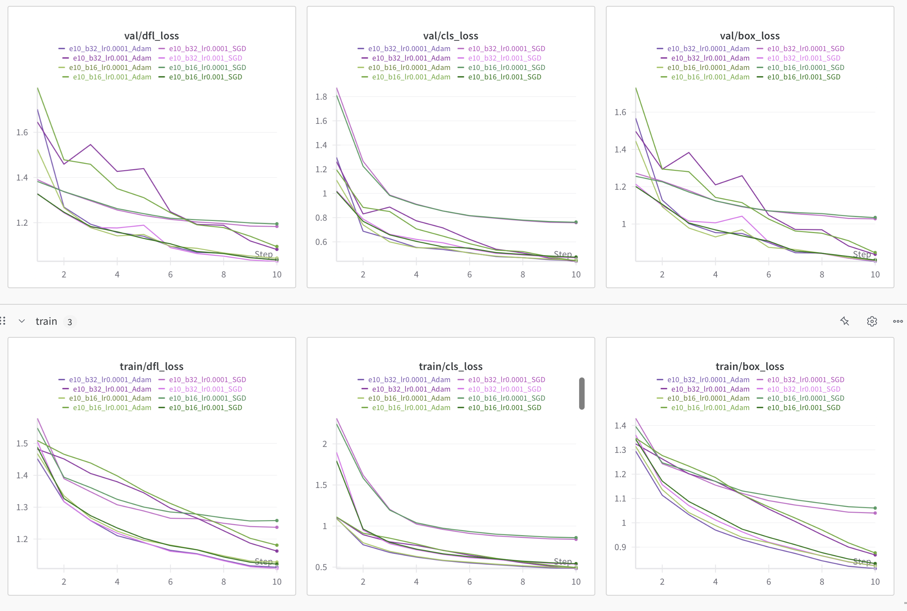
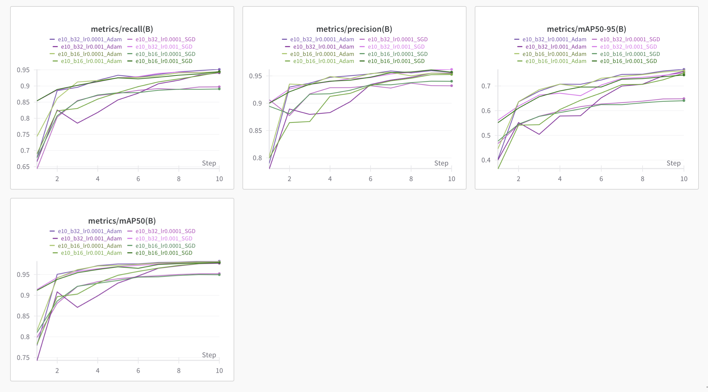
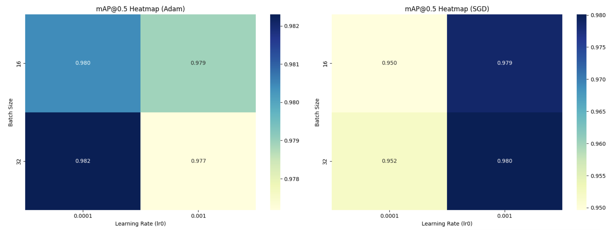
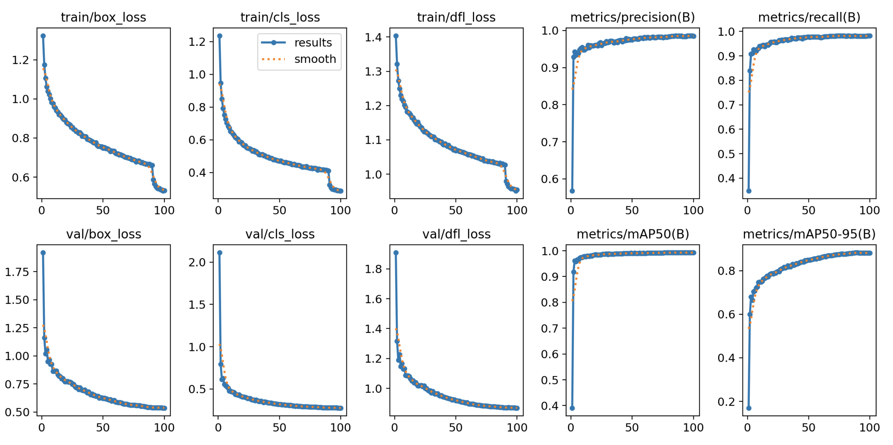
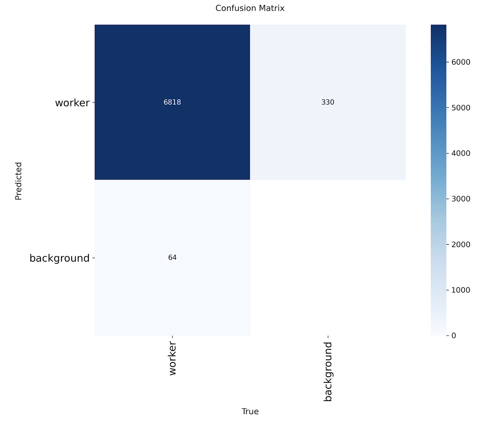
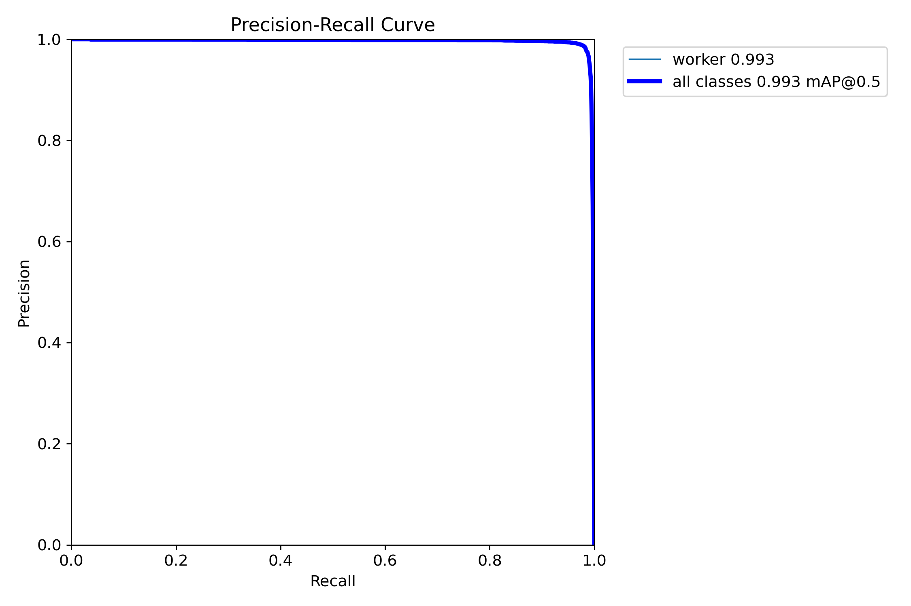
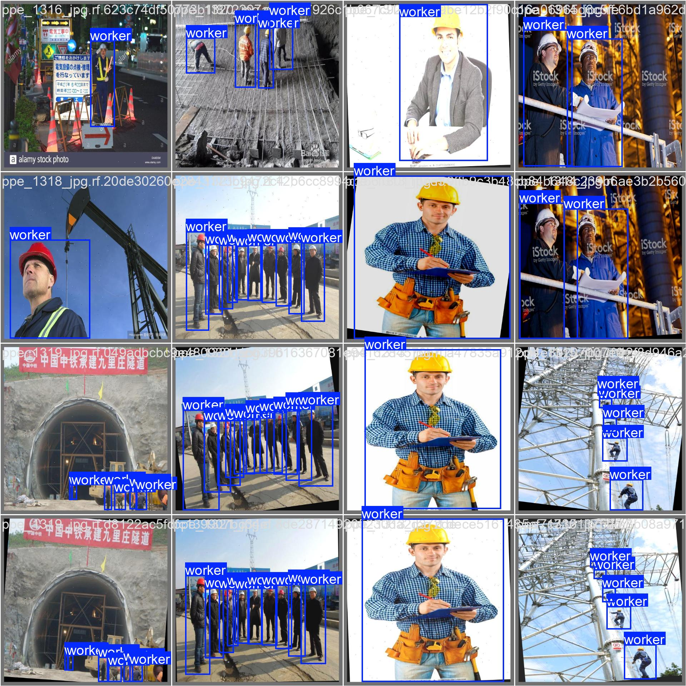
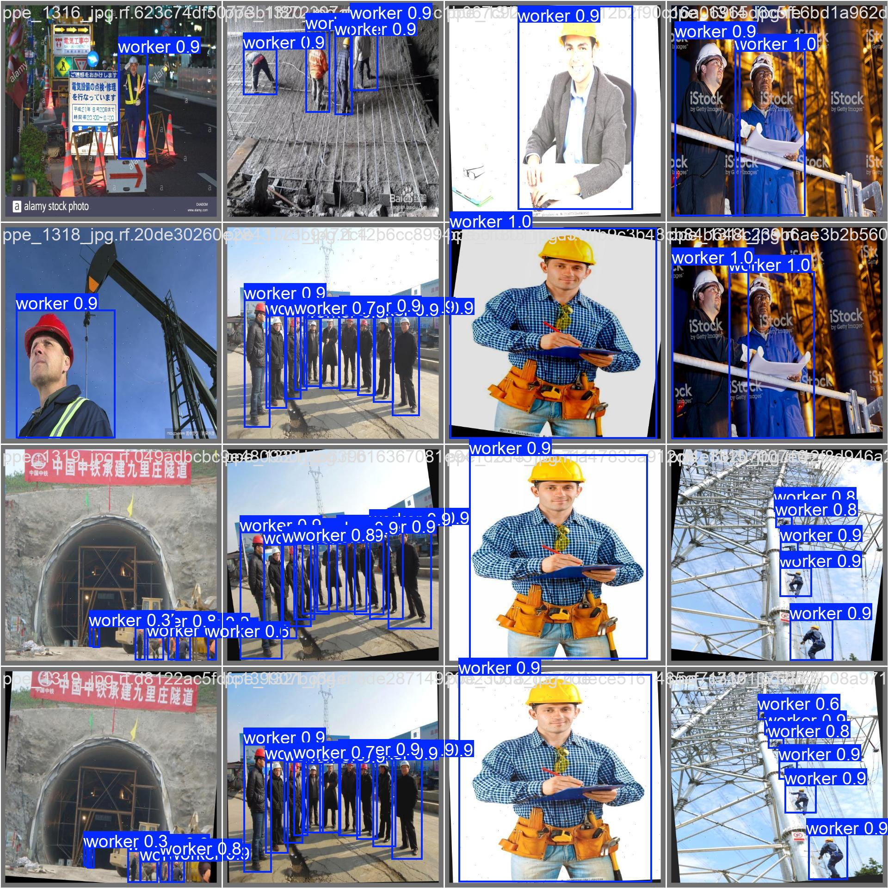

# Phase 2: Object Detection (YOLO)

**Author:** Nicolas Bieszczad

## Introduction

The aim of this phase is to understand how the YOLO (You Only Look Once) object detection framework works and to train a custom model tailored to detecting workers in a construction site environment.

Object detection is a fundamental task in computer vision that involves identifying and localizing objects within images. Among the various approaches, the YOLO algorithm has gained significant attention due to its real-time performance and high accuracy. First introduced by Redmon et al. in 2015, YOLO reframes object detection as a single regression problem, enabling the model to predict bounding boxes and class probabilities in one forward pass through the network. This approach offers a substantial advantage in speed over traditional two-stage detectors like R-CNN.

In this work, we focus on the latest iteration of the YOLO series — **YOLOv11** — which introduces a number of architectural enhancements to improve both accuracy and efficiency. Notable improvements include a more efficient backbone with C3k2 blocks, spatial attention modules (C2PSA), and the integration of the SPPF block for multi-scale feature aggregation. These innovations make YOLOv11 particularly well-suited for real-time tasks on resource-constrained devices, which is essential for deployment on site.

By leveraging YOLOv11, we aim to develop a model capable of accurately detecting workers across various scenes, helping to support safety and monitoring applications in industrial environments.

## Setup

### Dataset Selection and Preprocessing

To train our object detection model, it was essential to select a dataset that closely matched the real-world conditions of our use case. Specifically, we aimed to detect workers in outdoor construction environments, wearing high-visibility jackets and helmets. Furthermore, the model should also be able to detect workers even when they are not wearing personal protective equipment (PPE), which can happen on construction sites.

After exploring several options, we selected the *PPE Detection* dataset available on Roboflow ([link](https://universe.roboflow.com/shra-oaew2/ppe-detection-mzosm)), originally composed of 4,455 images. Before proceeding with preprocessing, we applied data augmentation using Roboflow's built-in augmentation tools. These included transformations such as brightness and saturation adjustments, rotations, and Gaussian blur. As a result, the dataset was expanded to a total of 13,365 images.

Next, we performed several preprocessing steps to tailor the dataset to our specific objective. The original dataset included multiple classes such as `helmet`, `vest`, and `person`, but since our goal was to detect workers regardless of equipment, we retained only the `person` class. The following steps were taken:

* We filtered out all images that did not contain at least one instance of the `person` class, to ensure that the model would receive positive training signals.
* We removed all annotations associated with other classes.
* We renamed the `person` class to `worker` and reassigned its class ID.

After augmentation and preprocessing, the dataset was split into:

* 8,735 images for training
* 2,505 images for validation
* 1,256 images for testing

These preparation steps allowed the model to focus exclusively on detecting human workers, increasing its robustness and effectiveness in diverse construction site conditions.

### Evaluation Metrics

To evaluate the performance of the object detection model, we rely on standard metrics commonly used in the field: **Precision**, **Recall**, and **mean Average Precision** (mAP).

**Precision** measures the proportion of true positive detections among all detections made by the model. A high precision indicates a low number of false positives.
**Recall** evaluates the model's ability to detect all relevant instances in the dataset, measuring the proportion of true positives among all ground truth objects.

The main metric for object detection tasks is the **mean Average Precision** (mAP), which combines both precision and recall across various Intersection over Union (IoU) thresholds. In our evaluation, we report:

* **mAP\@0.5**: the average precision when predictions are considered correct if their IoU with ground truth boxes is at least 0.5.
* **mAP\@0.5:0.95**: the average of mAP values computed at multiple IoU thresholds ranging from 0.5 to 0.95 in steps of 0.05, providing a more stringent assessment of the model's localization quality.

Although our model detects only a single class (*worker*), computing mAP is still relevant and informative. It provides a nuanced view of the model’s ability to localize this class accurately and consistently across different IoU thresholds. The simplification to a single class allows for a focused evaluation while maintaining compatibility with standard detection pipelines and metrics.

### Hyperparameter Selection and Model Setup

To identify the most suitable training configuration for our object detection task, we performed a grid search over three key hyperparameters: *batch size*, *optimizer*, and *initial learning rate*. Specifically, we explored the following values:

* Batch sizes: `16`, `32`
* Optimizers: `SGD`, `Adam`
* Learning rates: `1e-3`, `1e-4`

Each combination was trained for 10 epochs using the YOLOv11n model architecture on our annotated dataset.

The grid search results were logged and visualized using **Weights & Biases (W\&B)**, allowing us to compare all training runs simultaneously. For each run, we analyzed the training and validation loss curves, as well as key performance metrics including:

* `mAP@0.5`
* `mAP@0.5:0.95`
* `Precision`
* `Recall`

These were evaluated per epoch and per run.

   
  
   
 
  <figcaption><strong>Figure 1.</strong> Loss and metric curves for different hyperparameter configurations </figcaption>  
  

   
  <figcaption><strong>Figure 2.</strong> Heatmaps showing mAP@0.5 across batch size, learning rate, and optimizer </figcaption>  

The configuration with **batch size = 32**, **optimizer = Adam**, and **learning rate = 0.0001** emerged as the most promising. It achieved the highest scores across most metrics — including `mAP@0.5`, `mAP@0.5:0.95`, and `Recall` — and ranked third only in `Precision`. However, in the context of worker detection, **recall is more critical**, as the primary objective is to detect all workers and minimize the risk of missing any. The small drop in precision was acceptable given the significant gain in recall.

Moreover, the training and validation loss curves for this configuration were smooth and showed a consistent downward trend, indicating effective learning and convergence. Compared to other hyperparameter combinations, this setup demonstrated strong generalization and overall performance, justifying its selection for the final training phase.

Based on these results, the final YOLOv11n model was trained using the optimal configuration:

* **Batch size**: 32
* **Learning rate**: 0.0001
* **Optimizer**: Adam

The final training was run for **100 epochs** without early stopping to allow full convergence and to observe long-term learning dynamics. This approach aimed to ensure that the model had sufficient time to stabilize and achieve peak performance on the validation set.

## Results

### Training

During training, the model achieved strong performance metrics on the validation set:

* **mAP\@0.5**: 0.9929
* **mAP\@0.5:0.95**: 0.8827
* **Recall**: 0.9832
* **Precision**: 0.9861

   
  <figcaption><strong>Figure 3.</strong> Training evolution of loss and metrics </figcaption>  

### Test Set

After training, the final model was evaluated on the test set to assess its generalization capability. The performance remained consistently high, showing excellent detection and localization quality.

| **Metric**    | **Score** |
| ------------- | --------- |
| Precision     | **99.1%** |
| Recall        | **98.2%** |
| mAP@0.5      | **99.4%** |
| mAP@0.5:0.95 | **89.4%** | 

<figcaption><strong>Table1.</strong> Metric results for test set </figcaption>  

These results indicate that the model is highly effective at detecting workers in construction site imagery. The particularly high **recall** is crucial in safety-critical applications, ensuring that very few workers go undetected. The high **mAP\@0.5** further confirms reliable detection, while **mAP\@0.5:0.95** reflects accurate localization over a range of IoU thresholds.

#### Confusion Matrix

   
  <figcaption><strong>Figure 4.</strong> Confusion matrix on test set </figcaption>  

From the confusion matrix:

* **True Positives (TP)**: 6818 workers correctly detected
* **False Positives (FP)**: 330 backgrounds misclassified as workers
* **False Negatives (FN)**: 64 workers missed (classified as background)

#### Precision-Recall Curve

   
  <figcaption><strong>Figure 5.</strong> Precision-Recall curve on test set </figcaption>  

The large area under the curve confirms that the model maintains both high precision and high recall across a range of confidence thresholds.

#### Qualitative Results

  
   
  <figcaption><strong>Figure 6.</strong> Comparison between ground truth and predicted bounding boxes on test images </figcaption>  

As shown above, the model is capable of accurately detecting workers in various conditions — including diverse poses, lighting, and backgrounds. Most detections are made with high confidence, demonstrating strong internal certainty.

### Real-life data

To further assess the performance of the trained model in realistic conditions, we applied it to two videos captured from real-world construction sites that were not part of the training or testing datasets. These examples illustrate the model's ability to generalize and detect workers in diverse environments. We used here a confidence threshold of 0.5 Here are some frames coming from those videos.

  
   
  <figcaption><strong>Figure 6.</strong> Real-world image examples </figcaption>  

These results suggest that the model is robust when deployed in practical scenarios, maintaining high detection accuracy even under conditions that differ from the dataset.

## Discussion

While the model demonstrated strong performance on the test set, some limitations and practical considerations must be addressed for real-world deployment.

First, the choice of confidence threshold plays a critical role in the quality of the detections. A threshold that is too low results in the display of predictions with low probability, increasing the number of false positives. Conversely, a threshold that is too high may cause the model to miss valid detections, particularly in uncertain or occluded scenarios. Fine-tuning this parameter is essential to achieving a balance between precision and recall, and it may need to be adapted dynamically depending on the deployment environment.

Secondly, during visual evaluation on real-life images, we observed that the model sometimes struggles to detect multiple workers when they are positioned very closely together. In such densely packed scenes, overlapping bounding boxes or occlusions may cause the model to detect only part of the group, leaving some individuals undetected. This could potentially be improved by refining the model with more examples of such scenarios or using a higher-capacity variant of YOLO.

Lastly, while the model shows promising results on both test and real-life data, deployment in a real-world hardware setup is necessary to fully evaluate its robustness and reliability. Testing in an operational environment would provide valuable feedback on performance under varying lighting conditions, camera angles, and real-time constraints, and could reveal edge cases not captured during training or testing.

## Conclusion

Overall, these findings highlight that although the model is effective in controlled scenarios, careful calibration and further adaptation are required for successful deployment in real-world applications.

Through this project, I gained valuable insights into object detection using the YOLO (You Only Look Once) architecture. I had the opportunity to study how the model works, understand its internal structure, and apply it to a practical use case. Training a custom YOLO model for worker detection highlighted the importance of aligning the dataset with the conditions of the target environment. Specifically, I learned that for a model to perform effectively in real-world scenarios, the training data must closely resemble the visual and contextual conditions in which the model will be deployed.

Another key learning point was the role of the confidence threshold in controlling the trade-off between false positives and false negatives. Choosing an appropriate confidence value is not only critical for achieving good performance metrics but also crucial when integrating the model into a hardware system, where real-time predictions must be both accurate and reliable.

This project also deepened my understanding of the entire training pipeline, particularly the impact of hyperparameter selection. Performing a grid search over different learning rates, batch sizes, and optimizers revealed how tuning these parameters significantly influences the model's learning dynamics, convergence behavior, and final accuracy. It emphasized that finding the right training configuration is not arbitrary—it requires a systematic and data-driven approach.

## Future Work 
While the results are promising, several improvements could be explored. One direction is refining the model's post-training calibration by adjusting the confidence threshold dynamically based on deployment conditions. Additionally, collecting data directly from the environments where the system will be used—such as actual construction sites—would enable fine-tuning the model with context-specific visual features, thereby improving its robustness and reducing domain shift. Another future step involves increasing the training duration beyond the current number of epochs to evaluate whether the model continues to improve and converge further. Together, these strategies could enhance the model's reliability and suitability for real-world deployment.

